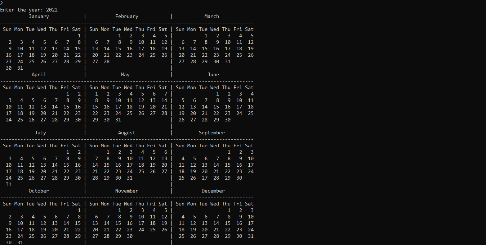

# Calender

This is a C++ program on calender I made while learning to code. The idea popped in my mind when I saw that the operating system actually limits the maximum and minimum year in the calender :)
The main aim of this project is to allow a user to get the calender of any year.

# Features

This application allows a user to view the calender of literally any year entered!. (0 - MAX integer limit). The application is designed to work on all modern computer systems due to its small size and small memory requirements. This application can also be compile to run on any operating system.
Hopefully, This application can serve to users as an agenda or a quick way to get specific date information in the past or future.

# Tools
- Visual Studio Code
- GNU G++17 v11.2.0 compiler
